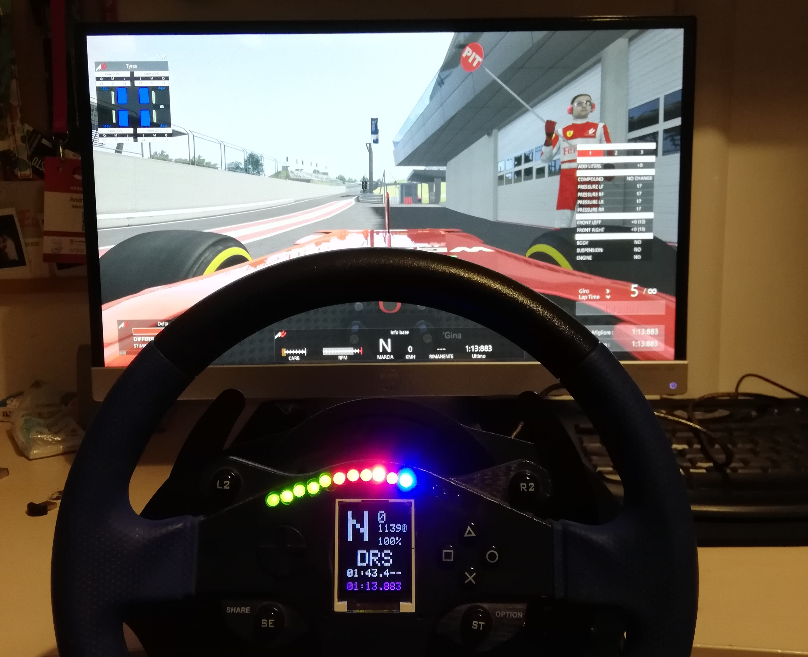
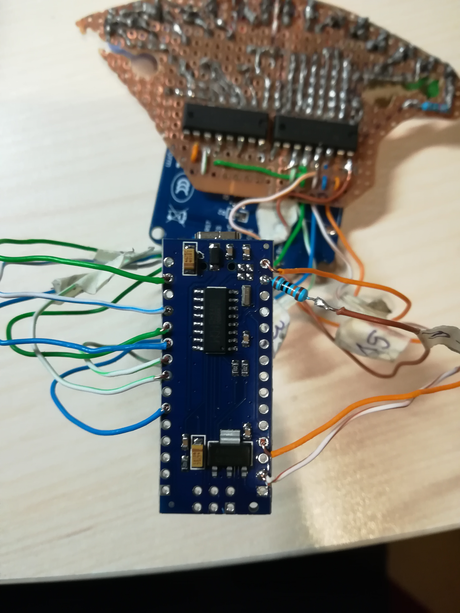

# SimRacingDashboard
Arduino project for sim racing games dashboard. 

### Display Feature
- Speed
- Rpm
- Current gear
- Current lap time
- Best lap time
- Microsector delta

### Other feature (Only some games)
- KersCharge status
- DRS activation

## How it works
Arduino as main component where LCD screen and all 15 leds are connected to. It recieves all the informations from SimHub, that catch it from the game and sends it through the serial port.

All data it's sent by a simple protocol defined in _protocol.js_ file. It is a specific sequence of variable each of them separated by ";".

## Requirements
### Hardware
- Arduino
- TFT Screen
- 15 leds
- 2 74hc595
### Libraries
- Adafruit_GFX
- Adafruit_ST7735

(You can find them inside libs folder of this project)

### Software
SimHub: https://www.simhubdash.com/
